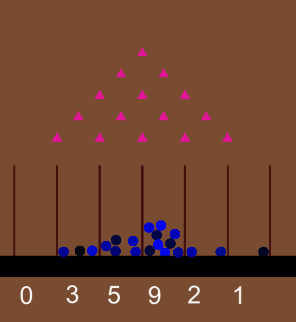

Authors: Erik Fahlman (efahlman@kth.se) and Fredrik Östlund (jfmos@kth.se).

This is the landing page for the project blog, here we will document the project journey post by post. Enjoy the ride!

Latex: 

$X \sim Bin(n, p)$

# 2023-02-16 First post!

This blog will follow the development of a physics simulation project in the course DD1354 Models and Simulations at KTH. 

The project aims to simulate a Galton Board. This is a toy where metal balls are dropped onto pegs that are arranged in a triangle-pattern. On each peg, the ball bounces of the peg and if it is calibrated(well built enough), there is roughly a 50/50 chance that the ball moves either to the right or to the left on each bounce. Each ball follows a binomial distribution **X~Bin(n, p)** where **n** is the number of rows in the board, and **p** is the chance of a bounce in either direction, i.e 0.5.

Together, all balls approximate a Probability Mass Function (PMF) of the binomial distribution (and given enough balls, a normal distribution).

See below for a picture on how it can look like.

We intend to implement this in Unity, without the help of built in physics engine. That is, we will try to do everything physics-related from scratch. The main physics components will be
 * Simulating gravity
 * Elastic collisions (meaning that no energy is lost within the system due to the collision) of two kinds:
     * ball-to-ball collisions, where the balls should react to eachother depending on their relative speeds and masses
     * ball-to-pin-collisions, where the pins are considered fixed, and the balls should bounce off them depending on angle and speed
 * Normal force, counteracting gravity when the balls become stationary on the ground

The intended end-result is that it should be possible to spawn a desired number of balls, seeing them bounce down through the board before settling in the bins. 
The ball-distribution should be that of a binomial distribution, where most balls should be located in the bins in the center, and then be approximately evenly thinning out to the sides. 

# 2023-02-23 Second post, project specification feedback!

Today we got feedback on our project specification by Chris himself:

"Excellent specification! The project idea is very good (great scenario) and is open to 'A' grade, depending of course on reporting. But since this project usually involves integrating a number of different physical forces together, for an 'A' grade, try to find one specific aspect of the physics simulation that you can go deep into, especially in the report (background equations, etc) and possibly in the implementation."

We are very excited that our idea is ambitious enough to qualify for a possible A grade. It was especially helpful to have emphasised that we need to focus on the physics simulation. The initial idea is to ensure that we pay close attention to the elastic collisions of the balls. However, there might be other aspects to consider. For now though, we are going through with this idea.

# 2023-02-28 Third post, brainstorming and implementation approach.

Today we started brainstorming and formulating a plan about how to attack this project.

The main challenge is that neither of us have much experience with Unity, so the task seems rather daunting since it's such a massive and versatile tool.

We agreed to focus on having a "minimum viable product" ready and focus on the core behaviour (i.e. not spending all our project time on making the textures look fancy).

We looked back on the previous labs that we had done in the course to try to take some inspiration, and also researched some basic tutorials and guides on the web. Of course we also looked into some of the past project blogs for inspiration, but more often than not they only contained some images and text, and not the nitty gritty details about the implementations.

This means that we will be going in to this fairly blind. One challenge we have found is that, since we intend to implement all physics from scratch, we will not be using the physics simulation engine provided by Unity. Since most actual application use Unity's simulation engine (it is one of the main attractors of Unity) it is quite hard to find good sources on how to best do this. Another challenge is that, since Unity is such a widely used tool, there is much discussion going on about it on the internet. This introduces further challenge to finding good information. The information space is simply bloated, and when coming from virtually nothing experience-wise, it is hard to filter out the good from the bad advice. 

In any case we are sure that we will manage to create something satisfying in the end. even if it means we will have to invent our own ways of working!

# 2023-03-02 Fourth post, a MVP using the Unity-provided physics engine and a first try of our own implementation.

After spending time the last few days learning how to operate Unity and watching guides and reading articles it was finally time to get started with some implementing!
In order to get a feel of what we what to accomplish, we started by building a concept using all the tools provided by Unity. This means we utilized the different colliders and settings provided by Unity. We built the board by manually placing out different pegs and created a funnel so balls fall down approximately in the middle of the board. This worked quite well, and given how easy it was to set up, the end result looked quite good and it could easily handle many balls. See below for a screenshot. Unity is a remarkable tool!

Now it was time to try to do it ourselves. In the above example, we used Unity colliders and let the physics engine handle all collisions. We wanted to have access to the automatic collision detection so we settled for using collision triggers in our own implementation. This means that each object has its own collider, but on collisions nothing happens automatically, instead a trigger is sent to the object where our own physics related code will be run. 

We started by writing a script that places pegs on the board in a systematic fashion. We opted to model the pegs as triangles, as it intuitively works with the idea of a 50/50 chance of bouncing left and right if the ball hits the centre. Further, it makes clear that the balls and the pegs indeed are different objects.

We made a script to spawn balls on a fixed location when pressing the space bar. See the screenshot below for a first draft.

Our first step was implementing gravity. We chose to have a gravity method that for every simulation step accelerates each ball downwards. As we are doing everything from scratch, it was quite tricky to get the scales right. What does a gravity constant of, say, 10 mean when the scales of the world are arbitrary?

We managed to use the triggers to do rudimentary elastic collisions. However, we forgot to make the pegs fixed in place, which was not obvious as the simulation runs by only applying gravity to the balls. This has some unintended results.. 

This was easily fixed however. When setting the scaling, we naturally experimented with sizing of the colliders and objects themselves, resulting in unwanted behaviours when these are not aligned properly. 

Here is the final result from this day!

# 2023-03-03 Fifth post, continued refinement and bins!

We opted to implement peg-collision by doing reflections along the norm of the plane, depending on which side of the triangle that is hit. An unintended, by positive, consequence of using triangles as pegs is that it's quite easy to figure out the normal of the plane that constitutes either side that can be hit (the normal vector is the same regarless of where the ball hits). This means that the reflective angle, that becomes the new velocity vector of a ball hitting a side is also easy to figure out and work with. The same is done for the floor, but with the normal pointing upwards. This makes the balls bounce when hitting the ground!

We also built rudimentary bins, which as for now are smaller copies of the floor, with the normals pointing inwards!

This way, when the balls bounce off the bin-walls they bounce inwards, ideally trapping them inside the bins. However, sometimes they are forced through the walls when the "pressure" applied from above balls becomes large. We don't want that, but it works okay-ish for now. 

Since every ball is acting on each collision, bouncing off each other, this becomes quite heavy calculation wise even for modest amounts of balls. They don't settle but instead vibrate in place, colliding with each other. We tried to hit to birds with one stone and also counteract the ball-mass applying pressure downwards by making them static when hitting the walls or floors and having an absolute velocity lower than some small treshold. This sort of worked, but some balls are still pushed outside of the bins while some get stuck on the walls in an awkward way.

Anyhow, some progress!

# 2023-03-04 Sixth post, better elastic collisions between the balls!

The balls behaved correctly in the Y dimension, but it seemed like they bounced wierdly in the X-dimension. We figured out that this was because the formulas we used for elastic collisions was configured for only one dimension. After some digging around, we found an alternate way of simulating the elastic collisions, using an angle free scheme! This means that the collisions could be calculated using only relative velocities and positions of the balls. The simulation is starting to take shape!

Back to the bin-problem.

We further refined by experimentation how to make the balls become static objects. We opted to have a static-flag on each ball, which gets activated either when a ball touches the ground while moving with a small absolute velocity, or when touching another static ball when moving with a small absolute velocity. This makes the "static-ness" trickle upwards, in a decently realistic fashion. However, balls still get stuck in unintended places, leading to unnatural gaps in the bins. But we can have many more balls now!

# 2023-03-05 Seventh post, board building!

Another aspect of creating this simulation is how to scale the board. How far apart should the pegs be, how big should the balls be and how large should each bin be. Here is a work-in-progress screenshot showing our experimentation with this. As you can see, in this version there is an issue with balls being forced through the ground. 

It was time to set the pegs out in a triangular shape, we created an algorithm to do this systematically for an arbitrarly large board, however we opted to have five rows in total. Each row contains one peg more than the previous row, the spacing between each peg is two units large, and the starting location of each row is one unit to the left of the start peg for the previous row. Ta da!

Now onto the bin placements!

We created prefabs of bins each with a corresponding internal box-collider, using triggers. When a ball enters a bin they become flagged as belonging to the bin. This way, we can calculate what the maximum x and y-positions of each separate ball is, essentially trapping them inside a bin. Now, the balls don't float through the bin-walls anymore. Also, this made it easy to prevent the balls from clipping through the ground. They can still bounce out, however! 

But, as we see, there are some scaling issues remaining regarding the binomial distribution modeling. The balls tend to end up either in the central bins, or in the outmost bins. 

This was resolved through manual experimentation of the "bounci-ness" of each triangle. When a ball collides with a peg, we now scale the new velocity vector with a constant, making them bounce approximately to the next level of pegs if the ball hits on top of a peg. Now it's starting to look good!

Some further refinement with the vertical spacing of the triangles gave even better results! 

# 2023-03-06 Eight post (and final?) blog post! 
With the simulation running quite nicely, we decided to give each bin a counter to showcase the number of balls in each bin. We can see that the number of balls roughly follow a binomial distribution, with the most ball-mass located in the central bins and thinning out towards the tails.
